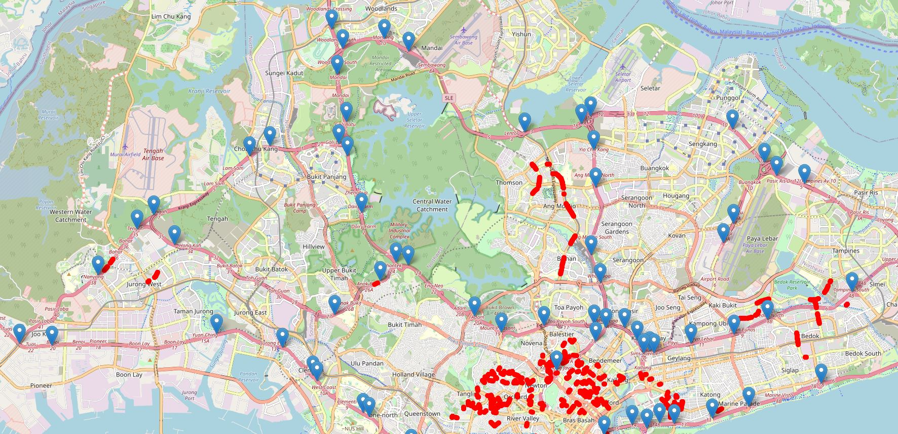

# Backend Documentation

## File Descriptions

### utils.py

Contains helper functions which help pre-process and generate new features for data retrieved from
LTA API. Also serves as to export one instance of data locally. Calling

```
python utils.py
```

Will export speed band data and traffic incidents to CSV files, while images are downloaded.

### crop.py

Two distinct uses:
1) Auto Cropping  
- Using pre-coded coordinates, crop images into 2.

2) Store cropping coordinates to be used as the coords in auto cropping  
Used to crop traffic images into their 2 distinct directions using OpenCV.  
Outputs an array of coordinates representing the cropped polygon which can be saved.  

Cropped Coordinates:
- In the case of there being only 1 direction in image: leave the second list BLANK!
- The auto cropping code checks for a blank list: will not be enough to put 0 in distance

How To Crop:
1) Ensure the images you want to crop are in images folder
2) go cmd and cd to this folder:
- py crop.py
- Enter image id
- An Image should pop up
- Click the image to "crop" the image into just 1 side of the road.
- Press Enter
- Image will close and a new cropped image will show up
- Check to see if cropped correctly
- Press Enter
- Original Image should pop up
- Click the image to "crop" the image for the other side of the road.
- Press Enter
- Image will close and a new cropped image will show up
- Check to see if cropped correctly
- Press Enter
- If both sides cropped correctly --> Copy the coords outputed on ur cmd


### find_density.py  
Takes in functions from crop, utils, count to combine and find the latest density from images taken from lta

## Design Decisions

**Omitting the use of speed band data**

Observe the following plot of camera locations vs observed speed band locations plotted using the following code :

```python
import folium
# create base map
m = folium.Map(location=[1.3521, 103.8198], zoom_start = 12)
# add camera locations to map
for id, lat, lng in zip(image_data.CameraID, image_data.Latitude, image_data.Longitude):
     marker = folium.Marker([lat, lng], popup = f"id: {id}")
     marker.add_to(m)
# add speedband locations to map
for road_name, lat1, lng1, lat2, lng2 in zip(speed_band_data.RoadName, speed_band_data.latitude1, speed_band_data.longitude1, speed_band_data.latitude2, speed_band_data.longitude2):
    points = [(float(lat1),float(lng1)), (float(lat2),float(lng2))]
    folium.PolyLine(points, popup = str(road_name), weight = 5, opacity = 1, color = "red").add_to(m)
```


Speed band data returned by LTA's sensors are typically 
1. Heavily clustered in the south 
2. Not relevant to the locations of their traffic cameras which are on **highways** only

The interactive plot is available at this [link](https://hewliyang.github.io/)

## Models Used

**Vehicle Counting**

We use a pre-trained YOLO V4 model to count the number of vehicles that can be seen from the traffic cameras.

The weights are not included in this repository, but can be retrieved from [AlexeyAB's](https://github.com/AlexeyAB/darknet/wiki/YOLOv4-model-zoo) repository. This file should be included under the ```models``` folder along with its associated ```.cfg``` file. 

An example of a detection can be seen in the following image :


## API
