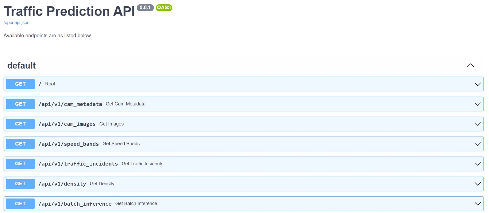
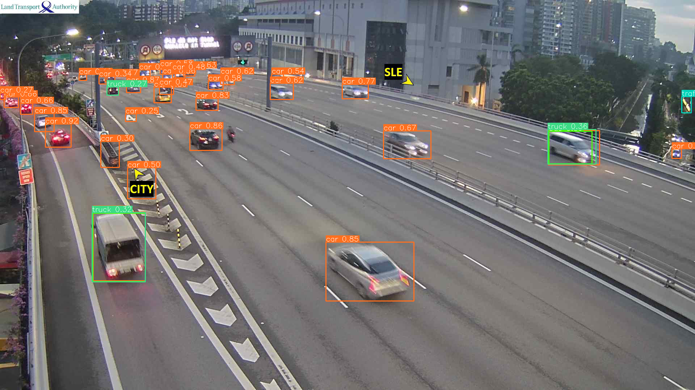

# Backend Documentation

**Demo : [http://13.212.85.6:5000/docs](http://13.212.85.6:5000/docs)**

## API 

**Follow the steps to run the API on your local computer**

1. **Docker**

Make sure the ```.env``` file is in this directory. Then simply run  

```docker build -t api .```  
```docker run -d -p 5000:5000 api```

2. **Virtual Environment (venv, virtualenv, conda)**

- Create a virtual environment of your choice; eg: 
```virtualenv venv```
- Activate virtual environment & Install dependencies
```source venv/Scripts/activate```
```pip install -r requirements.txt```
- Run ```mim install mmcv-full```
- Run the API with
```uvicorn main:app --port 5000```

The app is hosted on ```localhost (127.0.0.1)``` at port ```5000```. API documentation is available at ```127.0.0.1:5000/docs```



Specific usage examples can be found in the [api_demo notebook](https://github.com/hewliyang/dsa3101-2210-14-lta/blob/main/backend/api_demo.ipynb)

Example request :

```python
import requests
import pandas as pd
url = "http://127.0.0.1:5000/api/v1/density"
args = {"cameraID":1702}
r = requests.get(url, params=args)
output = r.json()
df = pd.DataFrame(output)
```

Please also note that the timestamp is returned in UNIX format. An example is ```1665939900000``` which translates to ```2022-10-16T17:05:00```. You may do the conversion as follows using the ```datetime``` module:

```python
from datetime import datetime
from time import strftime

ts = 1665939900000
ts = ts/1000
print(datetime.utcfromtimestamp(ts).strftime('%Y-%m-%dT%H:%M:%S'))
```

## File Descriptions

### **utils.py**

Contains helper functions which help pre-process and generate new features for data retrieved from
LTA API. Also serves as to export one instance of data locally. Calling

```
python utils.py
```

Will export speed band data and traffic incidents to CSV files, while images are downloaded.

### **crop.py**

Two distinct uses:
1) Auto Cropping  
- Using pre-coded coordinates, crop images into 2.

2) Store cropping coordinates to be used as the coords in auto cropping  
Used to crop traffic images into their 2 distinct directions using OpenCV.  
Outputs an array of coordinates representing the cropped polygon which can be saved.  

Cropped Coordinates:
- In the case of there being only 1 direction in image: leave the second list BLANK!
- The auto cropping code checks for a blank list: will not be enough to put 0 in distance

How To Crop:
1) Ensure the images you want to crop are in images folder
2) go cmd and cd to this folder:
- py crop.py
- Enter image id
- An Image should pop up
- Click the image to "crop" the image into just 1 side of the road.
- Press Enter
- Image will close and a new cropped image will show up
- Check to see if cropped correctly
- Press Enter
- Original Image should pop up
- Click the image to "crop" the image for the other side of the road.
- Press Enter
- Image will close and a new cropped image will show up
- Check to see if cropped correctly
- Press Enter
- If both sides cropped correctly --> Copy the coords outputed on ur cmd


### **find_density.py**  
Takes in functions from crop, utils, count to combine and find the latest density from images taken from lta
Given the density data, perform data preprocessing including removing 0s and outliers. Afterwards, scale and normalise the processed data and plot the values.


## Models Used

**Vehicle Counting**

We use a pre-trained [YOLOX model](https://github.com/Megvii-BaseDetection/YOLOX) in combination with [SAHI (Slicing Aided Hyper Inference)](https://github.com/obss/sahi) to count the number of vehicles that can be seen from the traffic cameras. 

The weights were obtained from [MMDet's Model Zoo](https://github.com/open-mmlab/mmdetection/tree/master/configs/yolox)

Sample inference:


